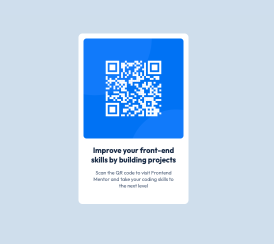

# Frontend Mentor - QR code component solution

This is a solution to the [QR code component challenge on Frontend Mentor](https://www.frontendmentor.io/challenges/qr-code-component-iux_sIO_H). Frontend Mentor challenges help you improve your coding skills by building realistic projects.

## Table of contents

- [Overview](#overview)
  - [Screenshot](#screenshot)
  - [Links](#links)
- [My process](#my-process)
  - [Built with](#built-with)
  - [What I learned](#what-i-learned)
  - [Continued development](#continued-development)
- [Author](#author)
- [Acknowledgments](#acknowledgments)

## Overview

### Screenshot

### Links

- Solution URL: [https://github.com/jgomero/qr-code-component]
- Live Site URL: [https://jgomero.github.io/qr-code-component/]

## My process

### Built with

- Semantic HTML5 markup
- CSS custom properties
- Flexbox
- Media query

### What I learned

I've learned how to work with flexbox in order to center the main container, also be more accure working with just an image and get the correct position and desgin for each element.

### Continued development

I would like to continuous learning on flexbox and how connect different elements inside of them.

## Author

- Frontend Mentor - [https://www.frontendmentor.io/profile/jgomero]
- Twitter - [@pepe_code]

## Acknowledgments

I would like to get feedback if the way that I worked this project is the correct and maybe other ways to do, so I can have different perspectives.
